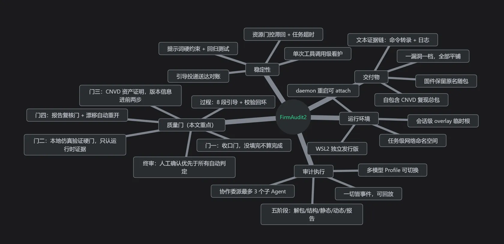
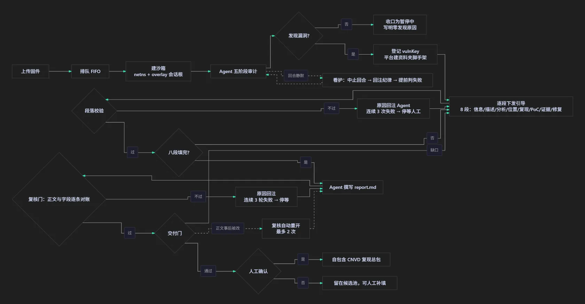

<p align="center">
  
</p>

<h1 align="center">FirmAudit2</h1>

<p align="center">
  <b>让 Agent 挖到的每一个固件漏洞都可回放、可校验、可交付</b><br />
  <sub>AI Agent × 固件安全审计 · 八段引导 · 四道结果门 · 会话级沙箱 · CNVD 交付总包</sub>
</p>

<p align="center">
  <a href="#为什么要有它">问题</a> ·
  <a href="#三层约束">约束设计</a> ·
  <a href="#四道结果门">质量门</a> ·
  <a href="#界面预览">界面预览</a> ·
  <a href="#实测数据">实测数据</a> ·
  <a href="#获取与授权">获取与授权</a>
</p>

---

> 本仓库仅包含 FirmAudit2 的**宣传站点与说明文档**，不包含任何产品源代码。产品为闭源商业软件。

## 为什么要有它

做固件审计的人大概都被这几件事磨过：

- 工具不缺，binwalk、FirmAE、radare2、QEMU 都在，可它们之间那段路全靠人肉走；
- 让大模型去跑命令，心里发虚——它一句 `apt install` 就能把环境搞乱；
- 它说"这里有个命令注入"，自己复现利用失败，转头追问，回答是：是你的操作有误；
- 真挖到了洞，后面还得手抄复现步骤、整理证据、套 CNVD 模板，一晚上又没了。

所以有了 FirmAudit2：**让 Agent 去查，同时把"结论可信"这件事本身变成一个工程问题——过程可回放、字段可校验、产物可核对。**

## 三层约束

| 层次 | 做法 | 换来什么 |
| --- | --- | --- |
| **过程约束** | 漏洞资料按 8 段逐段引导填充，每段过校验；段落表同时驱动引导提示词、校验规则与报告章节（单一事实源） | 报告结构可校验，不再靠模型自由发挥 |
| **结果约束** | 任务收口与交付前共四道门，判据取自文件里的运行时痕迹 | 结论必须自证，静态推断冒充不了验证 |
| **运行时约束** | 会话级 overlay 临时根 + 单次工具调用级活性看护 | 环境不被污染，卡死不会吃掉整轮预算 |

## 四道结果门

1. **收口门** —— 引导没填完就不许判定完成，待补清单直接写进任务状态；一小时后恢复，同一条漏洞接着从第 3 段填到第 8 段。
2. **本地仿真验证硬门** —— 证据里必须同时出现"目标被起来"和"目标给出结果"两类运行时痕迹；静态看出危险调用不算验证。
3. **CNVD 资产证明门** —— 版本信息必须由命令在复现的前两个编号步骤内给出，起目标之后再提不算。
4. **报告复核门** —— 正文与已入库的结构化字段逐条对账；复核通过后正文再被改动，缺口会重开这道门（上限 2 次）。

每条缺口在界面上都是一行能读懂的人话，操作员不必猜平台为什么不出包。

## 八段式引导

`漏洞信息 → 漏洞描述 → 代码分析步骤 → 代码位置 → 复现步骤 → PoC/Exp 脚本 → 证据文件 → 修复建议`

同一条漏洞填齐后，复现步骤从空变成近千字的命令级链路；「代码位置」也不再是一句"在某个服务里"，而是可核对的函数与指令序列。校验不通过时，打回原因会原样拼进下一次引导——回执则按原名留在资料夹里，收了还是拒了、下一步做什么，Agent 自己看得见。

## 界面预览

站点内的 [`index.html`](index.html) 提供**按产品界面结构还原的可交互模拟**：浅色默认主题、顶部状态栏、四张侧栏卡、任务头、六个页签（提示词｜进展图谱｜审计过程｜终端｜文件｜漏洞）、右侧巡检栏与底栏，页签可直接点击切换，暂停 / 中止只切换演示状态。

> 模拟里的任务名、条目名、文件名与全部数字**均为虚构示例**。本仓库不展示任何真实设备信息、固件信息或漏洞信息，也不展示任何人的 CNVD 收录记录。

## 实测数据

同一套约束，四种做法的结局对比（涉及的固件与条目名按绝密口径不予公开，此处只留计数与结局）：

| 时间 | 引导方式 | 段落入库 | 打回 | 结局 |
| --- | --- | --- | --- | --- |
| 9/19 14:17 | 5 个漏洞并行下发首段 | 0 | 0 | 引导发完就没下文，5 条全部无回应 |
| 9/20 06:33 | 4 个漏洞并行，已加校验回环 | 4（全是首段） | 12 | 4 条一起卡在第 2 段（复现步骤），任务最终失败 |
| 9/21 01:20 | 单漏洞串行推进 | 8/8 | 4 | 6 分 48 秒填齐，全部自愈 |
| 9/21 08:14 | 串行 + 8 段 + 回执 + 送达判定 | 24/24（3 个漏洞） | 7 + 1 次判丢重投 | 队首漏洞 6 分填完 7 段，第二、三个各用 4 分 40 秒、3 分 36 秒 |

看护阈值取自实测：本机运行库 419 次已完成的工具调用里，最长两次为 16.2 与 15.6 分钟，内容都是全盘扫描——15 分钟的静默阈值由此标定。

## 能力全景与流程

<p align="center">
  
</p>

<p align="center">
  
</p>

## 运行环境

- **会话级 overlay 临时根**：Agent 在回合里的系统写入全部落到会话私有上层，回合结束随之销毁；`/workspace` 绑定失败直接退出，绝不静默降级。
- **宿主整盘不进沙箱**：会执行任意命令的沙箱不接触宿主盘、密钥与任务数据；技能与 Agent 资产以真实副本预置进发行版本体。
- **离线工具链与国内镜像**：解包、仿真、逆向、转换依赖随发行版一次性部署，APT / pip / Node / npm 默认走国内源。
- **看护与断点续传**：工具调用静默 15 分钟、会话静默 30 分钟两级阈值；任务状态落盘，程序重启不打断正在跑的审计。
- **回连自检**：任务启动前探测沙箱到宿主模型网关的连通性，网络异常当场给出可读告警。

## 交付形态

任务收口时，过了门的漏洞会被打成一个自包含的 CNVD 复现资料总包：

- 一漏洞一档，材料全部平铺在包根，评审者不需要理解目录结构；
- 固件保留上传时的原文件名随包，脚本自行定位同目录的固件包，复现步骤里的相对路径才指得通；副本取不到就显式失败；
- 复现步骤到命令级，从校验哈希、出资产证明、起仿真到发请求，逐条能抄进终端；
- 报告以 Markdown 为唯一正文，Word 稿由其转换；交付包按内容哈希去重，"该进包却没进"的材料连同原因一并登记。

## 获取与授权

FirmAudit2 为**闭源商业软件**，采用设备绑定的离线授权（单设备永久授权）。

**前置环境**：Windows 11 x64、已启用 WSL2、磁盘建议 ≥ 40GB 可用、首次部署工具链需联网。大模型 API 需自备，平台不内置任何模型额度。

- 联系邮箱：`1703417187@qq.com`

## 本地预览宣传站

无需构建，任选一种方式：

```bash
# 方式一：直接用浏览器打开 index.html
# 方式二：起一个本地静态服务
python -m http.server 8080
# 然后访问 http://localhost:8080
```

## 资源说明

`assets/img/` 下只保留站点标识与两张原创概念图（能力全景、任务流程），全部下载到仓库本地直接引用，不外部热链。界面一律用 HTML/CSS 还原为结构模拟，不放真实运行截图：产品截图里的固件名、路径、函数名与漏洞条目属于绝密信息，不在任何对外页面出现。

## 致谢

FirmAudit2 的前端界面基于上游开源项目 **CTF-BTFly**（已获得作者授权用于闭源商用），在此致谢。

## 版权

© 2026 FirmAudit2 · 保留所有权利。本仓库内容（文案、宣传站点、原创概念图）仅供项目宣传使用；产品本体为闭源商业软件，未经授权不得转载或分发。
